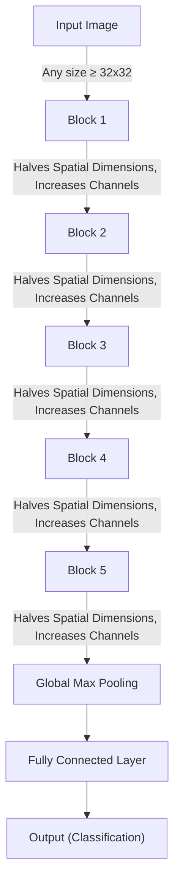

# IsoVolNet - Volume Preserving Convolutional Neural Network

**IsoVolNet** is a CNN architecture that maintains a constant feature volume (the product of spatial dimensions and the number of channels) throughout the network. This allows the model to adjust the number of channels while reducing spatial dimensions progressively, ensuring that the volume of the feature map remains constant.

The architecture uses depthwise separable convolutions to adjust the number of channels efficiently, followed by pooling layers to reduce spatial dimensions. The final feature map is reduced to a single value per channel through global pooling, followed by a fully connected layer for classification.

## Architecture Overview

The network consists of multiple blocks, where each block performs the following:
1. **Depthwise Separable Convolution**: First, depthwise convolutions preserve the spatial dimensions, and then pointwise convolutions adjust the number of channels.
2. **Pooling**: After the convolution operations, a pooling layer reduces the spatial dimensions (height and width) by a factor of 2.
3. **Global Pooling**: At the end of the network, a global max pooling layer reduces the spatial dimensions to 1x1 while keeping the number of channels intact.
4. **Fully Connected Layer**: Finally, a fully connected layer maps the features to the output classes.

The main innovation is that the product of the spatial dimensions (height × width) and the number of channels is preserved through the entire network, which provides a balance between feature complexity and computational efficiency.

### General Flow

1. **Input**: Any image with dimensions at least 32x32x3.
2. **Layer 1 to N**: Each layer maintains the constant volume (product of height × width × channels).
3. **Global Max Pooling**: Reduces the spatial dimensions to 1x1, preserving the total volume.
4. **Fully Connected Layer**: Outputs the classification result.

## Architecture Diagram

## Key Features

- Volume Preservation: The architecture ensures that the product of spatial dimensions and the number of channels remains constant throughout the layers.
- Depthwise Separable Convolutions: Reduces the number of parameters and computational complexity while still enabling the model to adjust the number of channels.
- Efficient Pooling: Uses pooling layers to reduce spatial dimensions progressively.
- Global Pooling: Reduces the final feature map to a 1x1 representation of the channels.
- Fully Connected Layer: The output of the global pooling layer is passed to a fully connected layer for classification.

## Advantages

- Computational Efficiency: By using depthwise separable convolutions, the number of parameters and computation is reduced compared to traditional convolutions.
- Adaptability: The architecture works with any image size, as long as it is greater than or equal to 32x32.
- Balance Between Detail and Abstraction: The constant feature volume ensures that the network can capture both fine-grained details and high-level features.
